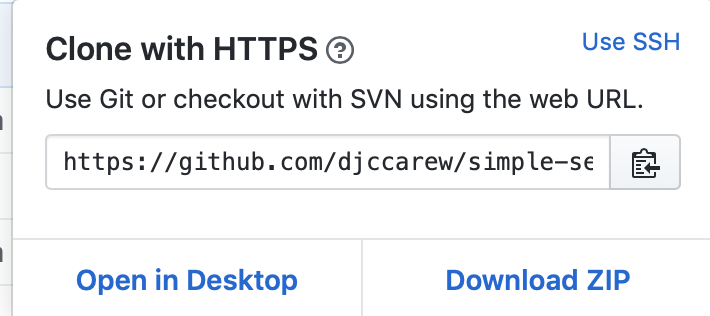
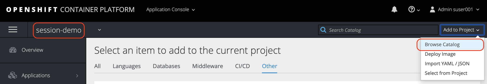
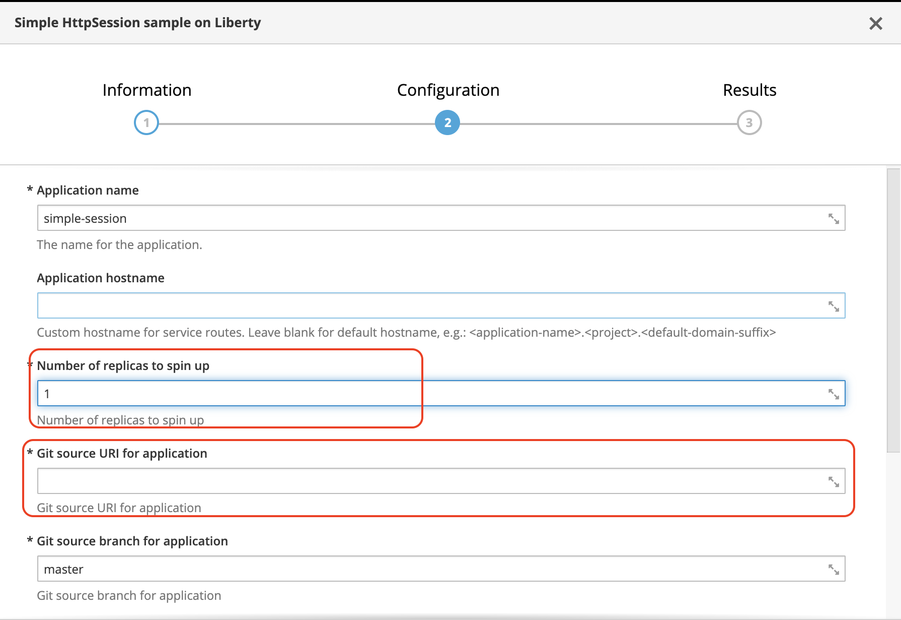
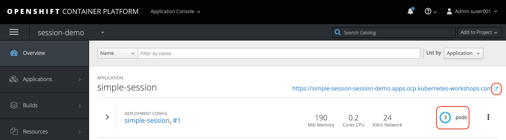

# IBM Client Developer Advocacy App Modernization Series

## Lab - HTPPSession replication in Open Liberty on OpenShift

## Overview

Open Liberty has a feature called **sessionCache-1.0** which provides distributed in-memory HttpSession caching. The **sessionCache-1.0** feature builds on top of an existing technology called JCache (JSR 107), which offers a standardized distributed in-memory caching API. However, even though the feature builds on top of JCache, no direct usage of JCache API is necessary in your application, since Liberty handles the session caching in its HttpSession implementation. In fact, if your application is already using HttpSession caching, it can benefit from **sessionCache-1.0 without making any code changes.**

In this lab you'll use these  capabilities  to deploy and test  a small Java EE app on OpenShift. You'll use an Open Source JCache provider called [Hazelcast](https://github.com/hazelcast/hazelcast) to provide the implementation of the JCache support that is included in Open Liberty. Any compliant JSR 107 product can be used in this manner with Open Liberty.

### Step 1: Logon into the OpenShift Web Console and to the OpenShift CLI

1.1 login into the OpenShift web console using  your user credentials

1.2 From the OpenShift web console click on your username in the upper right and select **Copy Login Command**

   

1.3 Paste the login command in a terminal window and run it (Note: leave the web console browser tab open as you'll need it later on in the lab)

### Step 2: Pull the Open Liberty base image from Docker Hub and push it to the OpenShift internal registry

2.1 Get the hostname of your OpenShift internal registry so you can push images to it

   ```bash
   export INTERNAL_REG_HOST=`oc get route docker-registry --template='{{ .spec.host }}' -n default`
   ```

2.2 Create a new OpenShift project for this lab

   ```bash
   oc new-project [YOUR PROJECT NAME]
   ```

2.3 Allow apps in the new project to access the Kubernetes API. The Hazelcast add-on for each pod  uses the k8s API to discover other pods using session replication.

   ```bash
    oc policy add-role-to-user view system:serviceaccount:`oc project -q`:default -n `oc project -q`
   ```

2.4 Download the Websphere Liberty base image

  ```bash
  docker pull websphere-liberty:kernel
  ```      

2.5 Tag the Websphere Liberty base image from Docker Hub appropriately for the internal registry

   ```bash
   docker tag websphere-liberty:kernel  $INTERNAL_REG_HOST/`oc project -q`/websphere-liberty:kernel
   ```

2.6 Login to the internal registry

   ```bash
   docker login -u `oc whoami` -p `oc whoami -t` $INTERNAL_REG_HOST
   ```
   **Note:** If this command fails make sure your internal docker registry  has a public route and the hostname of that route is added to you local Docker config under *Insecure registries* (if your registry's public route host uses https with a self signed certificate).

2.7 Push the Websphere Liberty base image to the internal registry

   ```bash
    docker push $INTERNAL_REG_HOST/`oc project -q`/websphere-liberty:kernel
   ```

### Step 3: Clone the Github repo that contains the code for the sample  app

3.1  Login in [your Github account](https://github.com)

3.2  In the search bar at the top left type in `djccarew/simple-session`

3.3  Select the repository `djccarew/simple-session` and then click on the **Fork** icon

3.4  Click the **Clone or download** button from your copy of the forked repo and copy the HTTPS URL to your clipboard

  

3.5  From the client terminal window clone the Git repo  with  the following commands  appending the HTTPS URL from your clipboard

   ```text
   git clone [HTTPS URL for NEW REPO]
   cd simple-session
   ```

### Step 4: Install the sample  app using a template that utilizes Docker  to build the app image   

4.1 Add the sample  app template to your OpenShift cluster

   ```bash
   oc create -f openshift/templates/docker/simple-session-liberty-template.yaml
   ```
4.2 In your Web console browser tab make sure you're in your new  project (top left) and click on **Add to Project -> Browse Catalog** (top right)

   

4.3 Select the **Other** category and then click **Simple HTTPSession sample on Liberty**

4.4 Enter the URL of your clone of the sample app repository and the number of replicas (e.g. 3)

   

4.5 Accept all the other default values and click **Create**

4.6 Click  **Continue to the project overview**

4.7 Wait until the Pod for the sample  app shows as running (and ready) then click on the route to get to the app's endpoint

   

### Step 5: Test the sample app

5.1 When you bring up the app with a new session the banner will say **Hello stranger**

   

5.2. Keep refreshing the URL and verify that the POD IP address changes each time and the current state of the  session data is maintained and used by all pods.

   

## FAQs

**What about sticky sessions ?**
For sticky sessions, Hazelcast is not needed at all. The  OpenShift route for the application by default will use sticky sessions when you have more than one replica. To disable sticky sessions the following annotation needs to be added to the app's route:
```
haproxy.router.openshift.io/disable_cookies: 'true'
```

**What changes were made to the app to support Hazelcast session replication?**
No code changes. The changes needed are to the *server.xml* file and the Dockefile that builds the app's container image. A Hazelcast config file and a jar file need to be added. Here is the snippet added to *server.xml* for this example:

```
...
<feature>servlet-4.0</feature>
<feature>sessionCache-1.0</feature>
...
<httpSessionCache libraryRef="JCacheLib" uri="file:/opt/ibm/wlp/usr/shared/config/hazelcast/hazelcast.xml" />
<library id="JCacheLib">
    <file name="/opt/ibm/wlp/usr/shared/resources/hazelcast/hazelcast-all-3.12.2.jar"/>
</library>
```
**Is peer-to-peer the only mode supported by Hazelcast?**
No. The peer-to-peer method used here is part of the Hazelcast open source offering(see [https://github.com/hazelcast/hazelcast](https://github.com/hazelcast/hazelcast)). A client-server implementation exists but is sold commercially. With client-server each Liberty pod acts as a client to a separate Hazelcast server deployment. The client-server approach uses less resources per application pod vs peer-to-peer and has more features (see [https://hazelcast.com/products/imdg/](https://hazelcast.com/products/imdg/)).
